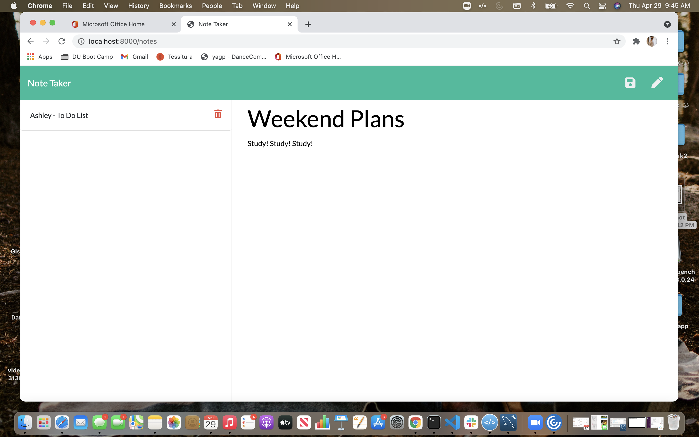

# 11-Express.js-Note-Taker

# Table of Contents
  
  1. [Description](#Description)
  2. [Installation](#Installation)
  3. [Usage](#Usage)
  4. [License](#License)
  5. [Contributing](#Contributing)
  6. [Questions](#Questions)
  7. [Demo](#Demo)

  # Description 
  

  # Installation
  The program is run with the command "node index.js"

  # Usage
  

  # Contributing
  Contributions are accepted
  

  # License
  
  

  # Questions:
  ## GitHub User name 
  ashleykohladler
  ### Link to GitHub:
https://github.com/ashleykohladler/11-Express.js-Note-Taker

  ### Link to Heroku:
  https://cryptic-mesa-91189.herokuapp.com/

  ### Email address 
  akohl22@gmail.com

  # Demo
  

  # Badges

  

  

